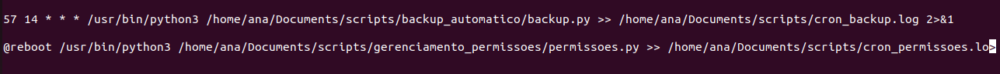

# Projetos Python

Este repositório contém três projetos Python para diversas finalidades. Cada projeto é descrito abaixo juntamente com suas funcionalidades principais.

## Projetos

### 1. Backup Automático

Este projeto realiza backups automáticos de arquivos de uma pasta de origem para uma pasta de destino. Ele copia os arquivos, preservando metadados, como timestamps, e é útil para manter cópias de segurança atualizadas.

### 2. Ajuste de Permissões de Arquivos

Neste projeto, os arquivos em uma pasta de destino de backup têm suas permissões ajustadas para garantir segurança e privacidade. O script define permissões específicas para leitura e execução, mas não para escrita.

### 3. Monitor de Uso de CPU e Memória por Processo

O terceiro projeto monitora o uso de CPU e memória por processo em tempo real e emite alertas caso os limites definidos sejam excedidos. É útil para identificar processos que consomem muitos recursos do sistema.

## Como Usar

1. Clone este repositório em seu ambiente local.
2. Navegue até o diretório do projeto que deseja utilizar.
3. Siga as instruções específicas de cada projeto descritas em seus respectivos README.md.

## Configuração do Cron Job

Para automatizar a execução dos scripts, você pode configurar cron jobs em seu sistema. Abaixo estão exemplos de cron jobs para cada projeto:

### Backup Automático

Essas adições fornecem informações sobre como configurar cron jobs para automatizar a execução dos scripts em intervalos específicos ou durante o boot do sistema.

