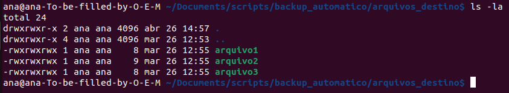
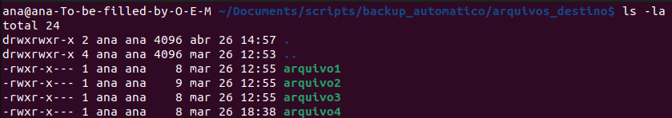

# Ajuste de Permissões de Arquivos no Backup Automático

Este script Python realiza o ajuste de permissões de arquivos em uma pasta de destino de um backup automático. Ele é útil para garantir a segurança e privacidade dos arquivos copiados, definindo permissões específicas para leitura e execução, mas não para escrita.

## Funcionalidade

O script utiliza a biblioteca padrão `os` do Python para percorrer recursivamente os arquivos na pasta de destino do backup e ajustar suas permissões.

## Como Funciona

- **Definição do Diretório de Backup**: O diretório de destino do backup é definido como `ajustar_permissões_backup`. Certifique-se de substituir esse caminho pelo diretório correto em seu sistema.

- **Iteração pelos Arquivos**: O script utiliza a função `os.walk()` para iterar recursivamente pelos arquivos na pasta de destino do backup.

- **Ajuste de Permissões**: Para cada arquivo encontrado, o script utiliza a função `os.chmod()` para ajustar as permissões do arquivo. No exemplo fornecido, as permissões são definidas como 0o750, o que significa permissões de leitura e execução para o proprietário e o grupo, mas sem permissão de escrita para nenhum usuário.

#### Antes do ajuste:

#### Após ajuste:

- **Exibição de Mensagens**: Durante o processo, o script exibe uma mensagem indicando que as permissões foram ajustadas para cada arquivo.

## Como Usar

1. Certifique-se de ter o Python instalado em seu sistema.
2. Abra um editor de texto e cole o código fornecido.
3. Substitua o caminho `ajustar_permissões_backup` pelo diretório de destino do seu backup automático.
4. Salve o arquivo com a extensão `.py`.
5. Abra um terminal e navegue até o diretório onde o script está localizado.
6. Execute o script com o comando `python nome_do_script.py`.

## Observações

- Este script assume que os arquivos na pasta de destino do backup já existem e têm permissões que permitam a modificação das permissões.
- Certifique-se de revisar e personalizar o caminho do diretório de backup antes de executar o script.
- Dependendo do sistema operacional e das permissões de usuário, pode ser necessário executar o script com privilégios elevados para realizar alterações nas permissões dos arquivos.

