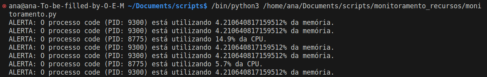

# Monitor de Uso de CPU e Memória por Processo

Este script Python monitora o uso de CPU e memória por processo em um sistema operacional e emite alertas caso os limites definidos sejam excedidos. Ele utiliza as bibliotecas `time` e `psutil` para realizar a monitoração em tempo real dos processos em execução.

## Funcionalidades

- **Monitoramento em Tempo Real**: O script monitora continuamente o uso de CPU e memória por cada processo em execução no sistema.

- **Definição de Limites**: Os limites para o uso de CPU e memória por processo são configuráveis no início do script. Por padrão, o limite de CPU é de 5% e o limite de memória é de 4%.

- **Alertas de Excedência de Limites**: Se o uso de CPU ou memória por qualquer processo exceder os limites definidos, o script emite alertas indicando o nome do processo, seu PID (Identificador de Processo) e o percentual de uso de CPU ou memória.

- **Intervalo de Verificação Configurável**: O intervalo de tempo entre as verificações pode ser ajustado conforme necessário. Por padrão, o script verifica o uso de CPU e memória a cada 5 segundos.

#### Monitoramento

## Como Usar

1. Certifique-se de ter o Python instalado em seu sistema.
2. Instale a biblioteca `psutil` utilizando o gerenciador de pacotes pip:
3. Abra um editor de texto e cole o código fornecido.
4. Personalize os limites de uso de CPU e memória conforme necessário, alterando as variáveis `limite_cpu` e `limite_memoria`.
5. Salve o arquivo com a extensão `.py`.
6. Abra um terminal e navegue até o diretório onde o script está localizado.
7. Execute o script com o comando:

## Observações

- Este script assume que o Python e a biblioteca `psutil` estão corretamente instalados no sistema.
- Certifique-se de revisar e ajustar os limites de uso de CPU e memória de acordo com as necessidades do seu sistema.
- Dependendo das permissões do usuário e do sistema operacional, pode ser necessário executar o script com privilégios elevados para obter informações detalhadas sobre todos os processos em execução.
- Este script é destinado a fins educacionais e de monitoramento e pode ser personalizado conforme necessário para atender aos requisitos específicos do usuário.

